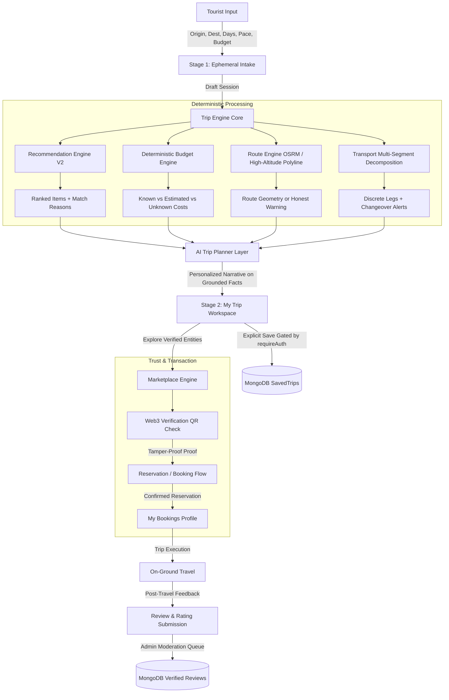

# DISCOVERY UTTARAKHAND — DATA FLOW & PROVENANCE SPECIFICATION
**Document:** `docs/DATA_FLOW.md`  
**Version:** 3.0.0  
**Date:** September 13, 2026

---

## 1. END-TO-END DATA FLOW PIPELINE

---

## 2. DETAILED PIPELINE STAGES

### Stage 1: User Intake (`/trip-planner`)
* **Inputs Captured:**
  1. Origin (explicit browser geolocation click OR selection from 10 departure hubs: Delhi, Agra, Dehradun, Haridwar, Haldwani, Rishikesh, etc.).
  2. Destination (queried from 89 official Uttarakhand destinations).
  3. Strict Duration (e.g. "7 Days" ➔ strictly parsed into 7 daily slots).
  4. Travelers count, transport preference, trip types (Trek, Spiritual, Nature, Adventure), interests, pace.
* **Storage Policy:** Ephemeral Zustand store + `localStorage`. **Zero database phantom records created**.

---

### Stage 2: Deterministic Engine Processing
* **Transport Decomposition:** Matches known transit corridors from `transports.json` (e.g. Kathgodam Shatabdi for Rail, UTC for Inter-state bus, local 4x4 mountain jeeps for Dharchula ➔ Gunji). Generates vehicle transfer alerts (`transferNote`).
* **Route Engine:**
  - Queries OSRM road driving engine.
  - If successful: returns road distance, drive hours, and road polyline geometry.
  - If high-altitude alpine trail or roadhead termination: sets `geometry: null`, `isRoadRoute: false`, and displays honest warning.
* **Recommendation Engine V2:**
  - Evaluates spatial distance from the day's overnight base.
  - Applies deterministic weighting against trip types, pace, and interests.
  - Appends transparent deterministic reason (e.g. *"Recommended because it is 15 km from your Day 2 base and matches your Nature + Relaxed pace"*).
* **Deterministic Budget Engine:**
  - Tabulates known verified stay rates (KMVN) and verified rail fares.
  - Calculates estimated food costs (e.g. ₹500/day/traveler) and average guide day rates.
  - Leaves unverified transit legs as `unknownCost` with explicit disclaimer.
  - Determines budget health status: `UNDER_BUDGET`, `NEAR_BUDGET`, `OVER_BUDGET`, `INSUFFICIENT_DATA`.

---

### Stage 3: Grounded AI Trip Planner
* **Context Ingestion:** Ingests the structured day plans, multi-segment transit legs, verified stays, and budget breakdown produced in Stage 2.
* **Task:** Synthesizes human-friendly daily guidance, highlights daylight driving requirements, altitude acclimatization protocols, and local cultural etiquette.
* **Strict Constraint:** The AI layer can **never** alter calculated budget numbers, change transport modes, invent prices, or override safety rules.

---

### Stage 4: My Trip Companion Workspace (`/my-trip/:tripId`)
* Displays the complete itinerary across the 5-part Day Cards:
  1. `📍 Where am I` (Gateway/Base/Destination)
  2. `🚗 / 🚆 How do I get there` (Multi-Segment transit stepper)
  3. `🥾 What am I doing` (Verified highlights & alpine trails)
  4. `🏨 Where am I staying` (Verified KMVN/partner accommodations)
  5. `➡️ What happens next & Strategy` (Daylight rules, next preview)
* Synchronized with the Leaflet Visual Journey Tracker map.

---

### Stage 5: Verification, Booking & Marketplace
* Tourist reviews verified partner badge on stay or guide cards.
* Clicking "Verify Partner" fetches the SHA-256 cryptographic verification record and displays the public blockchain proof without requiring a Web3 wallet.
* Booking submission creates a `Booking` record with `pending` status or provides an official deep link to government portals (`utconline.uk.gov.in`, `kmvn.in`, `irctc.co.in`).

---

### Stage 6: Travel & Post-Travel Reviews
* Post-trip, the traveler accesses `/profile` to view completed trips and submit structured ratings & reviews.
* Reviews enter an admin moderation queue before publication to prevent spam.

---

## 3. DATA PROVENANCE CLASSIFICATION

Every data field in Discovery Uttarakhand is strictly classified into one of four provenance tiers:

| Data Category | Provenance Tier | Handling & Display Rule |
|:---|:---:|:---|
| **Destinations, Shrines & Cultural Sites** | `STATIC VERIFIED` | Sourced from official district portals and state tourism registry. Published with source citation. |
| **KMVN / GMVN Government Stays** | `STATIC VERIFIED` | Sourced from official KMVN rest house tariff schedules. Price is tagged with `priceLastChecked`. |
| **Licensed Mountain Guides** | `STATIC VERIFIED` | Certified by state tourism authorities or mountaineering institutes (NIM, ABVIMAS). |
| **Interstate Transit Corridors** | `STATIC VERIFIED` | Verified rail schedules (IRCTC) and UTC express bus trunk routes. Timings & fares tagged with source. |
| **Unverified Transit Legs / Counter Fares** | `UNKNOWN` | Departure times and fares set to `null`. UI explicitly states: *"Schedule not verified (Check at counter)"* and *"Fare not verified"*. |
| **Food & Daily Sundries** | `ESTIMATED` | Calculated using regional meal estimates (₹500 - ₹800 / day / person). Always labeled as *"Estimated"*. |
| **Emergency / Altitude Buffer** | `ESTIMATED` | 10-15% buffer added to total trip estimate. Always labeled as *"Recommended Buffer"*. |
| **Live Bus Tracking / PNR Status** | `LIVE (PHASE 6)` | Handled via official external deep links until direct partner APIs are integrated. |
| **Mountain Weather & Snow Radar** | `LIVE (PHASE 6)` | Normalized adapter returning `LIVE`, `STALE`, `UNAVAILABLE`, or `UNKNOWN` status. |
| **Road Landslide Advisories** | `LIVE (PHASE 6)` | Normalized adapter with freshness timestamp and official USDMA/BRO attribution. |
