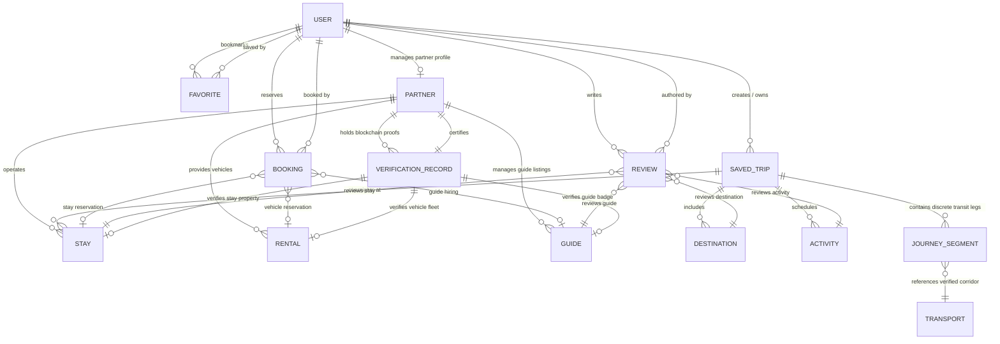

# DISCOVERY UTTARAKHAND — DOMAIN MODEL SPECIFICATION
**Document:** `docs/DOMAIN_MODEL.md`  
**Version:** 3.0.0  
**Date:** September 13, 2026

---

## 1. DOMAIN ENTITY RELATIONSHIP DIAGRAM

---

## 2. DETAILED ENTITY DEFINITIONS

### 2.1 User (`User`)
* **Role:** Represents tourists, verified partner owners, guides, and system administrators.
* **Fields:**
  - `_id`: ObjectId
  - `name`: String (required)
  - `email`: String (required, unique, indexed)
  - `password`: String (hashed with bcryptjs)
  - `phone`: String
  - `role`: Enum `['user', 'partner_owner', 'partner_guide', 'admin']` (default: `'user'`)
  - `profileImage`: ImageSchema
  - `location`: String
  - `isActive`: Boolean (default: `true`)
  - `timestamps`: CreatedAt, UpdatedAt

---

### 2.2 Destination (`Destination`)
* **Role:** Official geographic attractions and high-altitude hubs.
* **Fields:**
  - `_id`: ObjectId
  - `name`: String (required)
  - `slug`: String (required, unique, indexed)
  - `district`: String (indexed)
  - `region`: Enum `['Kumaon', 'Garhwal']`
  - `location`: GeoJSON Point `{ type: "Point", coordinates: [lng, lat] }` (2dsphere indexed)
  - `altitudeMeters`: Number
  - `highlights`: [String]
  - `experiences`: [String]
  - `bestTimeToVisit`: String
  - `isFeatured`: Boolean
  - `provenance`: `{ source, sourceUrl, lastUpdated }`

---

### 2.3 Stay (`Stay`)
* **Role:** Accommodations (KMVN tourist rest houses, GMVN mountain lodges, verified homestays).
* **Fields:**
  - `_id`: ObjectId
  - `partner`: ObjectId -> `Partner` (optional for government-run KMVN/GMVN)
  - `name`: String (required)
  - `slug`: String (required, unique, indexed)
  - `category`: Enum `['Government Tourist Rest House', 'Government Eco Camp', 'Heritage Luxury Hotel', 'Verified Homestay']`
  - `district`: String (indexed)
  - `city`: String
  - `location`: GeoJSON Point `{ type: "Point", coordinates: [lng, lat] }` (2dsphere indexed)
  - `price`: `{ amount: Number, currency: "INR" }`
  - `pricePerNight`: Number (computed from price.amount)
  - `verificationStatus`: Enum `['DRAFT', 'PENDING_VERIFICATION', 'VERIFIED', 'ACTIVE', 'SUSPENDED']`
  - `verificationRecord`: ObjectId -> `VerificationRecord`
  - `amenities`: [String]
  - `images`: [ImageSchema]
  - `provenance`: `{ source, sourceUrl, lastUpdated }`

---

### 2.4 Rental / Vehicle (`Rental`)
* **Role:** Self-drive cars, motorbikes, and 4x4 high-altitude taxis.
* **Fields:**
  - `_id`: ObjectId
  - `partner`: ObjectId -> `Partner`
  - `name`: String (required)
  - `slug`: String (required, unique, indexed)
  - `category`: Enum `['Bike & Scooter Rental', 'Self-Drive Car Rental', 'High-Altitude 4x4 Mountain Fleet']`
  - `district`: String (indexed)
  - `location`: GeoJSON Point (2dsphere indexed)
  - `vehicles`: Array of `{ name, type, pricePerDay, image, fitnessCertificateNumber, isVerified }`
  - `verificationStatus`: Enum `['DRAFT', 'PENDING_VERIFICATION', 'VERIFIED', 'ACTIVE', 'SUSPENDED']`

---

### 2.5 Guide (`Guide`)
* **Role:** Licensed mountain guides, spiritual pandits, and cultural interpreters.
* **Fields:**
  - `_id`: ObjectId
  - `user`: ObjectId -> `User`
  - `partner`: ObjectId -> `Partner`
  - `name`: String (required)
  - `slug`: String (required, unique, indexed)
  - `location`: String
  - `district`: String (indexed)
  - `specialties`: [String]
  - `languages`: [String]
  - `experienceYears`: Number
  - `govtLicenseNumber`: String
  - `verifiedByGovt`: Boolean (default: `false`)
  - `verificationRecord`: ObjectId -> `VerificationRecord`
  - `pricing`: `{ perDay: Number, perTrek: Number, currency: "INR" }`

---

### 2.6 Activity & Trek (`Activity`)
* **Role:** Verified trekking trails, river rafting, and alpine experiences.
* **Fields:**
  - `_id`: ObjectId
  - `name`: String (required)
  - `slug`: String (required, unique, indexed)
  - `category`: Enum `['Trekking', 'River Rafting', 'Paragliding', 'Pilgrimage', 'Camping', 'Safari']`
  - `district`: String (indexed)
  - `difficulty`: Enum `['Easy', 'Moderate', 'Challenging', 'Strenuous']`
  - `duration`: String (e.g. "4-6 Hours", "5 Days")
  - `maxAltitudeMeters`: Number
  - `permitRequired`: Boolean (e.g. Inner Line Permit)

---

### 2.7 Transport Corridor (`Transport`)
* **Role:** Curated registry of verified interstate and intra-state transit corridors.
* **Fields:**
  - `_id`: ObjectId
  - `mode`: Enum `['Bus', 'Train', 'Taxi', 'Shared Jeep', 'Local Transfer', 'Trek on Foot']`
  - `routingType`: Enum `['road', 'rail', 'trek', 'local_transfer', 'unknown']`
  - `operator`: String (e.g. "Uttarakhand Transport Corporation (UTC)", "Northern Railway")
  - `serviceName`: String (e.g. "Kathgodam Shatabdi", "UTC Interstate Express")
  - `origin`: `{ name: String, district: String, stationCode: String }`
  - `destination`: `{ name: String, district: String, stationCode: String }`
  - `stops`: [String]
  - `departureTime`: String or null (unverified policy)
  - `arrivalTime`: String or null
  - `price`: `{ min: Number, max: Number, currency: "INR" }` or null
  - `bookingUrl`: String (official operator deep link)
  - `source`: String (e.g. "UTC Route Registry")
  - `sourceUrl`: String

---

### 2.8 SavedTrip (`SavedTrip`) — Canonical Trip Entity
* **Role:** Persisted user travel itineraries with full multi-segment journey data.
* **Fields:**
  - `_id`: ObjectId
  - `user`: ObjectId -> `User` (required, indexed)
  - `title`: String (required)
  - `startingLocation`: `{ name: String, coordinates: [Number, Number] }`
  - `destination`: ObjectId -> `Destination`
  - `destinations`: [ObjectId -> `Destination`]
  - `startDate`: Date
  - `endDate`: Date
  - `duration`: String (strict constraint e.g. "7 Days")
  - `travelers`: String
  - `transport`: String
  - `tripType`: [String]
  - `interests`: [String]
  - `pace`: String
  - `budgetPreference`: String
  - `status`: Enum `['DRAFT', 'PLANNED', 'SAVED', 'MODIFIED', 'BOOKED', 'COMPLETED', 'REVIEWED']`
  - `routeData`: Mixed (totalDistanceKm, estimatedTime, isRoadRoute, geometry)
  - `itinerary`: Array of DayPlan objects:
    - `dayNumber`: Number
    - `title`: String
    - `phase`: String
    - `location`: `{ name, district, coordinates }`
    - `journeySegments`: Array of `{ legIndex, mode, routingType, from, to, operator, departureTime, price, transferNote, source, isVerified }`
    - `activities`: [String]
    - `trekDetails`: Object (difficulty, elevation, duration)
    - `stay`: `{ name, location, category, stayId }`
    - `reasoning`: String
    - `whatsNext`: String
  - `budgetBreakdown`: Object (totalEstimatedCost, minCost, maxCost, knownCost, unknownCost, budgetStatus)
  - `timestamps`: CreatedAt, UpdatedAt

---

### 2.9 Booking (`Booking`)
* **Role:** Reservation records for stays, vehicle rentals, or certified mountain guides.
* **Fields:**
  - `_id`: ObjectId
  - `user`: ObjectId -> `User` (required, indexed)
  - `type`: Enum `['stay', 'rental', 'guide']` (required)
  - `stay`: ObjectId -> `Stay` (required if type === 'stay')
  - `rental`: ObjectId -> `Rental` (required if type === 'rental')
  - `guide`: ObjectId -> `Guide` (required if type === 'guide')
  - `vehicleSnapshot`: `{ name: String, type: String, pricePerDay: Number }`
  - `startDate`: Date (required)
  - `endDate`: Date (required)
  - `guests`: Number (min: 1)
  - `amount`: Number (snapshot price or null if unverified)
  - `currency`: String (default: "INR")
  - `amountNotes`: String (e.g. "Negotiate directly with guide")
  - `status`: Enum `['pending', 'confirmed', 'cancelled', 'completed']` (default: `'pending'`)
  - `paymentStatus`: Enum `['pending', 'paid', 'failed', 'refunded']` (default: `'pending'`)
  - `notes`: String
  - `verificationRecord`: ObjectId -> `VerificationRecord` (proof of verified partner)

---

### 2.10 Review (`Review`)
* **Role:** Authenticated ratings and reviews for destinations, stays, guides, and activities.
* **Fields:**
  - `_id`: ObjectId
  - `user`: ObjectId -> `User` (required, indexed)
  - `targetType`: Enum `['Destination', 'Spiritual', 'Culture', 'Activity', 'Stay', 'Rental', 'Guide']`
  - `target`: ObjectId (refPath: targetType, indexed)
  - `rating`: Number (1 to 5, required)
  - `comment`: String (max 2000 chars)
  - `status`: Enum `['pending', 'approved', 'hidden']` (default: `'pending'`)
  - `timestamps`: CreatedAt, UpdatedAt

---

### 2.11 Favorite (`Favorite`)
* **Role:** Quick bookmarks by authenticated tourists.
* **Fields:**
  - `_id`: ObjectId
  - `user`: ObjectId -> `User` (required)
  - `itemType`: Enum `['Destination', 'Spiritual', 'Culture', 'Activity', 'Stay', 'Rental', 'Guide']`
  - `item`: ObjectId (refPath: itemType, required)
  - Compound Index: `{ user: 1, itemType: 1, item: 1 }` (unique: true)

---

### 2.12 Partner (`Partner`) — NEW FOR PHASE 3
* **Role:** Registered tourism service operators (hotel owners, transport fleet owners, trekking agencies).
* **Fields:**
  - `_id`: ObjectId
  - `user`: ObjectId -> `User` (owner account)
  - `businessName`: String (required)
  - `businessType`: Enum `['Stay_Operator', 'Vehicle_Rental', 'Guide_Agency', 'Trek_Operator']`
  - `registrationNumber`: String (required for verification)
  - `district`: String (required)
  - `contactPhone`: String
  - `contactEmail`: String
  - `verificationStatus`: Enum `['DRAFT', 'PENDING_VERIFICATION', 'VERIFIED', 'ACTIVE', 'SUSPENDED', 'REJECTED']`
  - `verificationRecord`: ObjectId -> `VerificationRecord`
  - `timestamps`: CreatedAt, UpdatedAt

---

### 2.13 VerificationRecord (`VerificationRecord`) — NEW FOR PHASE 5
* **Role:** Tamper-evident cryptographic proof linking a partner or vehicle to the blockchain.
* **Fields:**
  - `_id`: ObjectId
  - `partner`: ObjectId -> `Partner` (required)
  - `entityType`: Enum `['Stay', 'Vehicle', 'Guide']`
  - `entityId`: ObjectId
  - `verificationHash`: String (SHA-256 hash of credential bundle)
  - `contractAddress`: String (deployed smart contract address)
  - `blockchainTxHash`: String (transaction hash on Ethereum / Polygon)
  - `verifiedAt`: Date
  - `verifiedByAdmin`: ObjectId -> `User`
  - `qrCodeDataUri`: String (data URL for scanning proof)
  - `isValid`: Boolean (default: `true`)
