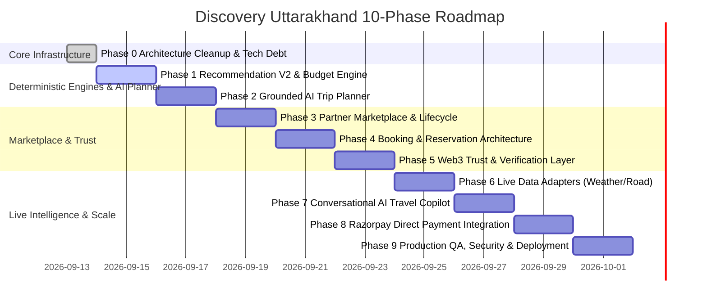

# DISCOVERY UTTARAKHAND — FINAL IMPLEMENTATION ROADMAP
**Document:** `docs/FINAL_IMPLEMENTATION_ROADMAP.md`  
**Version:** 3.0.0 (Master Execution Plan)  
**Date:** September 13, 2026

---

## EXECUTION RULES
1. **Zero Coding Before Approval:** Phase 0 documentation must be fully aligned before touching any source code.
2. **Deterministic Foundations First:** AI layers and Web3 layers must be anchored to deterministic backend engines and real database schemas.
3. **Non-Disruptive Evolution:** Preserve all working features (`/trip-planner`, `/my-trip/:tripId`, Leaflet visual tracker, OSRM mountain routing, multi-segment stepper, JWT auth).
4. **No Fabricated Facts:** Always honor null unverified data and display honest counter/deep link notices.

---

## 10-PHASE IMPLEMENTATION SCHEDULE

---

### PHASE 0: Architecture Cleanup & Technical Debt Resolution (CURRENT)
* **Deliverables:**
  1. Complete Master Architecture Documentation:
     - `docs/FINAL_ARCHITECTURE.md`
     - `docs/DOMAIN_MODEL.md`
     - `docs/API_CONTRACTS.md`
     - `docs/DATA_FLOW.md`
     - `docs/FINAL_IMPLEMENTATION_ROADMAP.md`
     - `docs/FINAL_GAP_REPORT.md`
  2. Resolve schema duplication debt: deprecate [`backend/models/Trip.js`](file:///c:/Users/ak/Desktop/DISCOVERY%20UTTARAKHAND/backend/models/Trip.js) in favor of [`backend/models/SavedTrip.js`](file:///c:/Users/ak/Desktop/DISCOVERY%20UTTARAKHAND/backend/models/SavedTrip.js).
  3. Resolve frontend/backend booking payload discrepancy between [`DetailPage.jsx`](file:///c:/Users/ak/Desktop/DISCOVERY%20UTTARAKHAND/Frontend/src/pages/DetailPage.jsx) and [`bookingController.js`](file:///c:/Users/ak/Desktop/DISCOVERY%20UTTARAKHAND/backend/controllers/bookingController.js).
  4. Decompose monolithic [`MyTripPage.jsx`](file:///c:/Users/ak/Desktop/DISCOVERY%20UTTARAKHAND/Frontend/src/pages/MyTripPage.jsx) into modular components (`DayCard.jsx`, `JourneySegmentStepper.jsx`, `WorkspaceAdvisories.jsx`, `ModifyTripModal.jsx`) preserving 100% of visual design and state behavior.

---

### PHASE 1: Recommendation Engine V2 + Deterministic Budget Engine + Trip Integration
* **Deliverables:**
  1. **Recommendation Engine V2:**
     - Create `backend/services/recommendationService.js` implementing deterministic multi-factor scoring:
       $$\text{Score} = w_1 S_{\text{loc}} + w_2 S_{\text{int}} + w_3 S_{\text{type}} + w_4 S_{\text{pace}} + w_5 S_{\text{season}} + w_6 S_{\text{time}}$$
     - Mount `POST /api/recommendations` in Express backend.
     - Generate transparent deterministic rationale strings for every recommendation.
  2. **Deterministic Budget Engine:**
     - Create `backend/services/budgetEngine.js` calculating `totalEstimatedCost`, `minCost`, `maxCost`, `knownCost`, `unknownCost`, and `budgetStatus` (`UNDER_BUDGET`, `NEAR_BUDGET`, `OVER_BUDGET`, `INSUFFICIENT_DATA`).
     - Mount `POST /api/budget/calculate`.
     - Zero hallucinated exact costs.
  3. **Frontend Integration:**
     - Embed `BudgetBreakdownCard.jsx` inside [`MyTripPage.jsx`](file:///c:/Users/ak/Desktop/DISCOVERY%20UTTARAKHAND/Frontend/src/pages/MyTripPage.jsx).
     - Display scored recommendations with deterministic match reasons.

---

### PHASE 2: Grounded AI Trip Planner + Structured AI Service Abstraction
* **Deliverables:**
  1. Create pluggable `backend/services/aiPlannerService.js` supporting Google Gemini / OpenAI drivers.
  2. Strict RAG Context: Pass structured itinerary days, multi-segment transit, and budget breakdown into the prompt.
  3. Mount `POST /api/ai/plan` returning day insights and acclimatization advisories.
  4. AI rule of law: AI never invents hotel rates, changes transport modes, or fabricates safety rules.
  5. Mount "AI Insights" ribbon in the companion workspace.

---

### PHASE 3: Partner Marketplace + Admin Verification + Listing Lifecycle
* **Deliverables:**
  1. Implement `Partner` schema with statuses: `DRAFT`, `PENDING_VERIFICATION`, `VERIFIED`, `ACTIVE`, `SUSPENDED`, `REJECTED`.
  2. Partner onboarding portal and listing management for Stays, Rentals, and Guides.
  3. Admin moderation workflows in [`AdminManagement.jsx`](file:///c:/Users/ak/Desktop/DISCOVERY%20UTTARAKHAND/Frontend/src/pages/AdminManagement.jsx).

---

### PHASE 4: Booking & Reservation Architecture + My Bookings + External Fallback
* **Deliverables:**
  1. Unified booking reservation modal supporting stays, rentals, and guides.
  2. Direct one-click booking CTA in [`MyTripPage.jsx`](file:///c:/Users/ak/Desktop/DISCOVERY%20UTTARAKHAND/Frontend/src/pages/MyTripPage.jsx) day cards.
  3. Reservation management tab in [`ProfilePage.jsx`](file:///c:/Users/ak/Desktop/DISCOVERY%20UTTARAKHAND/Frontend/src/pages/ProfilePage.jsx) with cancellation lifecycle.
  4. Prominent official deep links (`utconline.uk.gov.in`, `kmvn.in`, `irctc.co.in`) when in-app availability is not directly contract-backed.

---

### PHASE 5: Web3 Trust & Verification Layer
* **Deliverables:**
  1. Hardhat development environment setup with local test network.
  2. Smart contracts:
     - `contracts/PartnerVerification.sol`
     - `contracts/VehicleRegistry.sol`
  3. Automated contract test suite verifying tamper-proof hashing and minting.
  4. Backend `backend/services/web3Service.js` (ethers.js) for hashing partner credential verification records (Identity documents remain off-chain in MongoDB).
  5. Scannable QR Verification Badge on stay, guide, and vehicle cards with zero MetaMask requirement for tourists.

---

### PHASE 6: Live Data Adapters (Weather, Road Advisories, Transit)
* **Deliverables:**
  1. Create decoupled service adapters:
     - `backend/services/weatherAdapter.js`
     - `backend/services/roadAdvisoryAdapter.js`
     - `backend/services/transitLiveAdapter.js`
  2. Normalized response envelope with freshness states: `LIVE`, `STALE`, `UNAVAILABLE`, `UNKNOWN`.
  3. Display dynamic warning pills on the Leaflet map and travel advisory cards.

---

### PHASE 7: Conversational AI Travel Copilot
* **Deliverables:**
  1. Conversational drawer in [`MyTripPage.jsx`](file:///c:/Users/ak/Desktop/DISCOVERY%20UTTARAKHAND/Frontend/src/pages/MyTripPage.jsx).
  2. Grounded Q&A system using current trip context (e.g. *"Is Day 4 suitable for senior citizens?"*).
  3. Guardrails preventing speculation on road safety or emergency conditions.

---

### PHASE 8: Razorpay & Direct Payment Integrations
* **Deliverables:**
  1. Razorpay checkout integration for verified partner reservations.
  2. Webhook verification for payment confirmation (`paid`, `failed`, `refunded`).
  3. Automated booking confirmation email/receipt generation.

---

### PHASE 9: Production QA, Security, Performance & Deployment
* **Deliverables:**
  1. Dynamic code-splitting using `React.lazy()` to reduce initial bundle under 400 kB.
  2. End-to-end regression testing across auth, trip planner, companion workspace, bookings, and admin.
  3. Security hardening: Rate limiting, Helmet, input sanitization, and ownership audits.
  4. Production deployment scripts and final handover verification.
